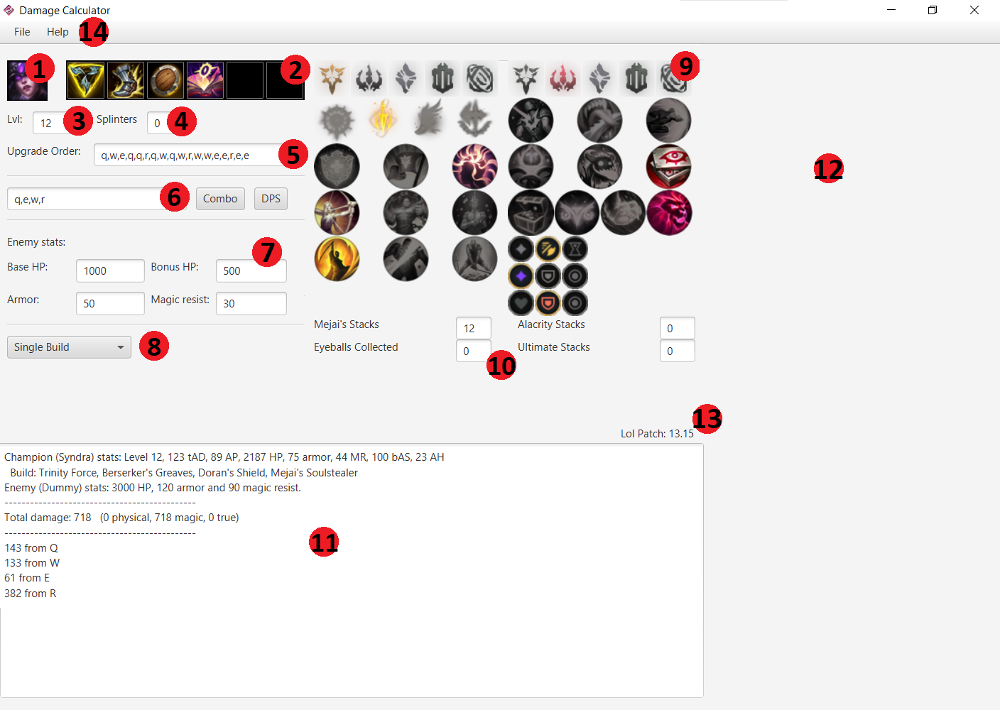
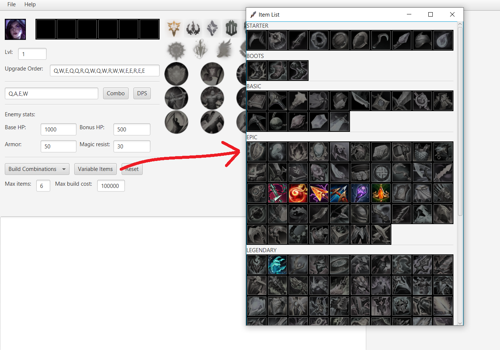
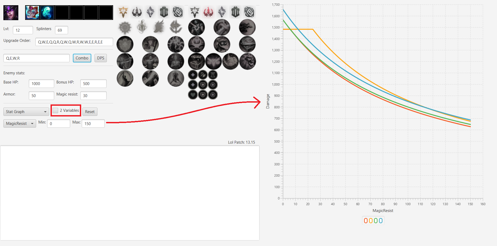
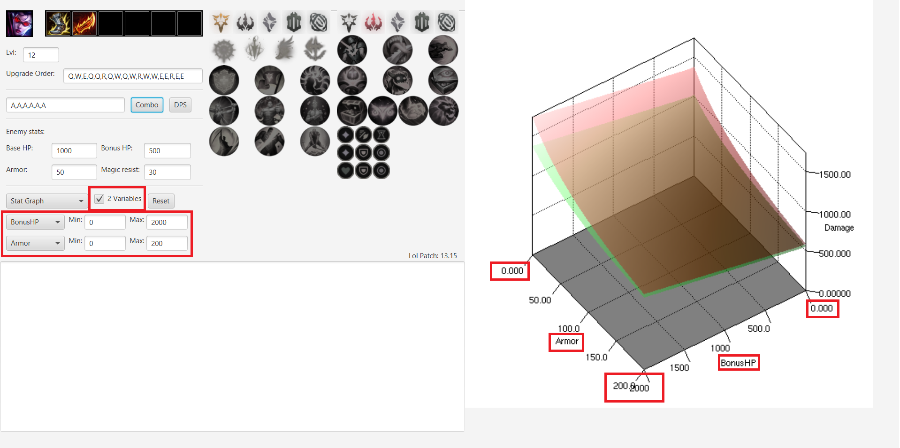

# League of Legends Damage Calculator
Tool to make analyzing builds a lot easier. Created to compare items and runes between each other and in many different situations, efficiently.

## How to use the program
The GUI has the following features:


The main screen will always look similar to this. All simulations will start running by pressing either the "Combo" or the "DPS" button.
1. **Champion:** the champion that will be used in the simulation (as offender). Clicking on it opens a new window with all the champions available to test. Clicking on a champion in that window selects it.
2. **Inventory:** if an item is clicked, it will get removed from the inventory. If an empty slot is clicked, a list of all items will appear (with the ones ineligible greyed out). Clicking a valid item in that list will add it to the inventory.
3. **Champion level:** number between 1 and 18
4. **Champion specific variable:** some champions have some kind of stacking mechanic (Syndra, Sena, ASol...). Set their starting value here.
5. **Ability upgrade order:** a list of 18 abilities (the detection is pretty sparing. Capitalization, spaces or commas, etc. doesn't matter).
6. **Combo / Ability priority:** when the button "Combo" is clicked, a simulation will start setting this list of abilities as the combo used. If "DPS" button is clicked, a simulation will start where it will try to use the first ability, if it can't, the second, if it can't, the third... Every champion has a specific ability priority order that maximises their DPS.
7. **Enemy stats:** to set the 4 main stats of the enemy, or defender.
8. **Mode select:** there are 3 modes available. The first one, "Single Build", has no extra configuration, and is the one shown in the image above (the other 2 are explained in more detail in the next section).
9. **Rune page:** interactive rune page
10. **Items and runes extra variables:** some items and runes have stacking mechanics (like Mejai's, ROA, Alacrity, Eyeball collection...). This space is to set their specific values before the start of the simulation.
11. **Output console:** the output is generated here (after starting a simulation with "Combo" or "DPS" button). If no output is generated, it is probably because too many combinations are being generated (in mode "Combinations"). If you don't know how much it can last, I recommend it to stop, since it could be from seconds to months, depending on the scale of the amount of possible combinations.
12. **Graph display:** when the mode "Stat Graph" is chosen (option inside (8) pop up), the generated graph after pressing the "Combo" or "DPS" output will be shown in this spot. More details in the next section.
13. **Current patch:** displays the League of Legends' patch this program is running on. If your patch is outdated, there probably is a newer version with the newest patch added.
14. **Menu bar:** the "File" menu enables saving and the current configuration to a file (and loading a configuration from a file). The "Help" menu has options that lead to this website.

### Testing build combinations
The second mode is "Build Combinations", and will look like this:

The "Variable Items" button opens a different item list, where the marked items are the ones that will be used to try every combination possible.
The "Reset" button resets this item list, with all items not chosen.

"Max Items" and "Max build cost" are constraints for what a combination can have. Keep in mind that combinations will include the
items present in the "Inventory" (6 item slots on top), so if "Max Items" is set to 3, but there are 2 items in the main Inventory already,
only groups of 3 and 2 items will be tested (that contain those 2 items).

As always, press the "Combo" or "DPS" button to obtain an output, in this case, through console.

### Displaying 2D and 3D graphs
The third mode is "Stat Graph", whose purpose is to test a build with a given range of enemy defensive stats. The UI looks like this:

In this case, the "2 variables" option is not selected, so only one variable will be tested (in this case, Magic Resist, from 0 to 150).
When a variable is selected to test a range for it, it will overwrite the value it had in the "Enemy stats" section (in this case, MR is overwritten).

This image shows that 4 different builds have been tested, and there are 4 "functions" drawn in the same space. To remove everything from the right side of the screen, just press the "Reset" button.

When the "2 variables" option is selected, the output is a 3D graph:

This case is only useful when comparing 2 variables is important, since it's a lot more difficult to visualize.
The right screen is interactive, in this case, and the graph can be moved around to see it in different angles (made with jzy3d).


## What it CAN do
Right now, only a few champions are implemented (they have to be handcoded).

For an implemented champion, it can assign it a build and runes and test 2 things:
- Calculate the damage done by a combo. In this example, Syndra used the combo {Q,E,W,Q,R}:
```
Champion (Syndra) stats: Level 13, 88 tAD, 277 AP, 1961 HP, 80 armor, 45 MR, 24 bAS, 20 AH
  Build: Sorcerer's Shoes, Luden's Tempest, Needlessly Large Rod, Hextech Alternator
Enemy (Dummy) stats: 2100 HP, 100 armor and 100 magic resist.
---------------------------------------------
Total damage: 1560.6393   (0.0 physical, 1486.2421 magic, 74.39725 true)
---------------------------------------------
459.15042 from Q
315.3361 from W
113.49315 from E
503.20172 from R
58.489304 from Hextech Alternator
110.968414 from Electrocute
```
- Calculate the time it would take to kill an enemy (similar to getting the DPS of a build). Example for (old items) Kai'sa:
```
Champion (Kai'sa) stats: Level 13, 301 tAD, 0 AP, 2294 HP, 78 armor, 85 MR, 243 bAS, 30 AH
  Build: Berserker's Greaves, Kraken Slayer, Wit's End, Blade of the Ruined King, Black Cleaver
Enemy (Dummy) stats: 7000 HP, 250 armor and 200 magic resist.
---------------------------------------------
Took 10.321321 seconds to kill.
Combo used: Q A E A W A A A A A A A Q A A E A A A A A A A A Q A A  (21A 3Q 1W 2E 0R)
---------------------------------------------
Total damage: 7244.4067   (4445.0815 physical, 1605.4052 magic, 1193.9199 true)
---------------------------------------------
2131.3281 from autos
987.1323 from passive
672.42883 from Q
140.60666 from W
1193.9199 from Kraken Slayer
454.99994 from Wit's End
1663.9911 from Blade of the Ruined King
```

You can get 3 types of outputs:
- Detailed description of the damage done, separated by type and by source of damage (autos, abilities, items, runes). This output is the one of the examples shown above.
- Comparison between builds (given a set of items, choosing every possible combination and giving each build a score). For example, here is the output after testing builds of size 3 on Lucian vs an enemy with 5k HP, 200 armor and 150 MR:
```
The best 15 builds, sorted by DPS (time taken to kill enemy):
  1.  (6.398496)  Kraken Slayer, Blade of the Ruined King, Lord Dominik's Regards
  2. (6.6045275)  Blade of the Ruined King, Navori Quickblades, Lord Dominik's Regards
  3. (6.6926136)  Kraken Slayer, Blade of the Ruined King, Navori Quickblades
  4. (7.1837745)  Kraken Slayer, Navori Quickblades, Lord Dominik's Regards
  5.  (7.737345)  Muramana, Blade of the Ruined King, Lord Dominik's Regards
  6.   (7.79224)  Kraken Slayer, Wit's End, Navori Quickblades
  7. (7.8248367)  Muramana, Navori Quickblades, Lord Dominik's Regards
  8. (7.9487615)  Trinity Force, Blade of the Ruined King, Lord Dominik's Regards
  9.  (7.972455)  Blade of the Ruined King, Navori Quickblades, The Collector
 10. (7.9779096)  Wit's End, Navori Quickblades, Lord Dominik's Regards
 11.  (8.050777)  Kraken Slayer, Essence Reaver, Navori Quickblades
 12.  (8.057613)  Trinity Force, Navori Quickblades, Lord Dominik's Regards
 13.   (8.22433)  Kraken Slayer, Muramana, Lord Dominik's Regards
 14.  (8.296218)  Guinsoo's Rageblade, Blade of the Ruined King, Lord Dominik's Regards
 15.  (8.429257)  Blade of the Ruined King, Wit's End, Lord Dominik's Regards
```
- Graphing a damage/time result of testing a build through a range of defensive stats, examples shown in the previous section.

## What it CAN'T do
This tool is to calculate DPS vs a "target dummy". It can't put 2 champions in a 1v1 and test their damage one against other.
Because of that, things like healing are not considered. For the same reason, a build that does similar damage compared to another, but it gives better tanky stats (for example, Wit's End vs BORK) won't be given any special score/reward/consideration.

The feature of getting a 1v1 is possible to implement, just not a priority right now (because there are a lot of champions to implement, which is more important), and it would be a bit pointless given the fact this program assumes you are hitting all the abilities and are trying to deal maximum DPS.


## How the simulation works
### Simulation Manager
Inside the "simulationManager" package, there are 4 essential files:
- BuildTester: Responsible for generating item combinations, testing them calling the "SimulationManager" class and sorting them.
- DamageCalculator: The class that runs the simulation. Uses abilities-autos-items, increases time, remembers when the next event will occur (an ability getting off-cooldown, the champion can auto again, an ability has expired...)
- Printer: Has all the funcions that print results through the terminal, called by "BuildTester" and "SimulationManager" classes to output the results
- SimulationManager: Responsible for creating new simulations, setting up initial variables and starting the simulation (that runs under a "DamageCalculator" instance).

### Simulation
Inside the package "simulationManager", there's also another package called "simulation", where items, abilities and champions are declared/defined.


These 4 classes: "Ability", "Champion", "Item", and "Rune" define the structure of an ability, champion or item. To create any of those, a new class that implements any of these classes is required.


All of them share the fact that they have stats that have to be filled. On top of that, the classes "Ability", "Item" and "Rune" have functions that can be overriten to implement the effects every unique ability/item does. 
Some classes can have additional variables, used to store some values for a specific purpose (like Black Cleaver stacks, Shadowflame current magic penetration...).

Almost all items are implemented inside the "items" folder, same for runes (although not the ones that don't intervene in combat, like triumph or approeach velocity).

"CurrentState" keeps track of some variables for the simulation, like the current time, and things that are not easily programmable on their own (for example, pointers to items that behave different than the rest like Riftmaker, Black Cleaver and Luden's. See "Damage" class to see how they are implemented). "CurrentState" also initialises variables inside the "simulation" package.

"Inventory" will make sure the items inside the class are legal to have in the game. It checks for discrepancies and it has a list of exclusive effects (lifeline, spellblade, crit modifier...)

Same for "RunePage", it will create an "organized" list of runes, setting keystone, both primary and secondary paths, shards...

"Damage" is the class responsible for applying damage to the enemy. It checks for modifiers, calculates the final damage taken armor and MR into account...

And finally, "AbilityType", "DamageType" and "RunePath" are just enums.

## Imperfections the program has
Although this program is a very faithful recreation on what happens exactly in game, there are some things that can't be taken into account (or are very difficult). Most of them are very slight issues that can just be ignored, tho.
- Mana cost is not taken into account.
- All healing and movement speed is ignored (irrelevant for damage calculations. Well, except for Hecarim...)
- Crit chance is programmed as a 5 auto cycle. For example, with 40%, it is {CCNNN} (C for crit, N for no crit). Therefore, a single crit cloak / zeal doesn't do anything right now (only works in steps of 20%).
- Sudden impact doesn't check if an ability is a dash (will assume it always is).
- Abilities don't have a CC boolean. This means things that have a special effect when an ability applies CC will always/never be taken into account (Evenshroud always applies the 10% more damage, Spear of Shojin will increase ability haste equally...)


## Things the program assumes
- Every ability hits.
- Things that have a delay (like Jinx E, that explodes after 0.9 secs if enemy is in contact) will get counted towards combo damage, even tho it would take more time to finish it completely.
- Burns (aka Liandry and Demonic) will complete their duration for combo damage calculation.
- The attacking champion is alone vs the deffending champion (no external buffs like Lucian vigilance).
- The program won't wait for Sheen cooldown before using an ability or similar niche things that would increase damage slightly. 
- Projectile travel distance is always 0. The program supposes you are melee range against the enemy.

## Champion specific details
### Ahri
- Q has no delay
- W has no delay
- R has no delay (all 3 casts are done instantly)

This shouldn't be much of a problem, since what you usually want to calculate with Ahri is combo damage, and not DPS.

### Jinx
- Passive not implemented, since she needs to kill a champion/objective to proc it
- Q means using Rocket Launcher, and Auto means using Fishbones
- Although swapping between Q and Auto is almost always consistent with real damage, spamming it will cause a false increase of DPS, since swapping doesn't have a cooldown applied (normally it's 0.9s)
- For consistency, only use either Q or Autos, when testing for DPS
- R damage is calculated as if Jinx was 700 units away (aprox.) from the enemy, which results on a 50% base damage
- W cast time is updated after each use, which results in a (very) slight time increase / DPS decrease

### Kai'Sa
- Q is applied instantly (doesn't take time for all projectiles to fly one by one)
- E cast time won't get updated (it scales with bonus attack speed and will only be calculated at the start of the simulation)
- R is not implemented, as it's only an auto reset

### Lucian
- To maximise passive damage, Lucian will try to auto after each ability use (the simulation will wait until an auto is done before using any other ability)
- If you are testing a Lucian combo, insert an auto attack between each ability, or the damage will be higher than it should (the "second" auto that passive provides is ALWAYS applied after each ability use)
- Vigilance is not implemented, since it's a 1v1 without external buffs

### Syndra
- If Syndra has 40 or more splinters, first Q cast won't make the ability go on cooldown
- Q has no delay
- W has no delay and no cast time
- Dark Spheres don't despawn

### Varus
- Passive not implemented, since he needs to kill a unit to proc it
- Q charge time is always 1.25 seconds (minimum time to reach max damage increase)
- To use W, first W must be cast, and then Q, like in game

### Vayne
- Q cast time is set to 0.4 seconds, since it's unlikely to always be near a wall when 1v1ing someone
- E will always do both instances of damage (it supposes the target will always collide with terrain)

### Zed
- Passive checks if enemy is below 50% hp after doing the auto (shouldn't be a problem unless it's a very specific case)
- Abilities don't consume energy
- Shadows don't despawn after their duration (but won't stack either, always 1 for W and 1 for R, maximum)
- Supposing all shurikens hit at the same time
- Supposing that W and R are never recasted

## Things planned to do
In parallel to adding new champions, these are the things planned to implement, in order of priority:
- Add the buffing effect of supporting items (like Zeke's, Staff...)
- Add CC flag to abilities (and everfrost) to fix the imperfection listed above
- Add mana costs for abilities (and deplete mana as the simulation goes on)
- Be able to add defensive items to the enemy (like frozen heart)
- Add potions (the ones that cost 500 and give AD, AP or HP)
- Add champion specific settings, like deciding if an ability sweet-spot should be hit

And lastly, implement the feature of being able to simulate 1v1s

## Questions
If you have any questions / requests / bug reports, please contact me on Discord (@paumb)