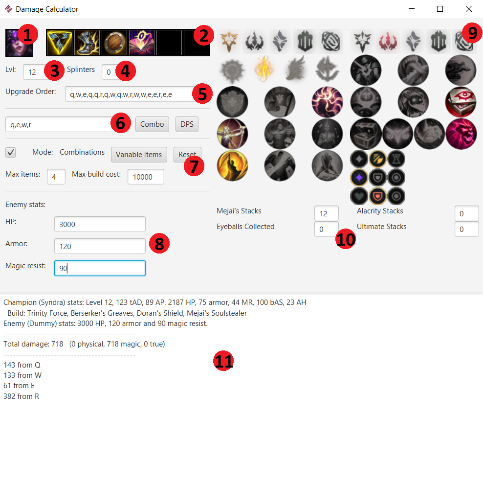

# League of Legends Damage Calculator
Tool to calculate DPS or damage made by a combo with a certain build and sort builds by performance.

## What it CAN do
Right now, only a few champions are implemented (they have to be handcoded).

For an implemented champion, it can assign it a build and runes and test 2 things:
- Calculate the damage done by a combo. In this example, Syndra used the combo {Q,E,W,Q,R}:
```
Champion (Syndra) stats: Level 13, 88 tAD, 277 AP, 1961 HP, 80 armor, 45 MR, 24 bAS, 20 AH
  Build: Sorcerer's Shoes, Luden's Tempest, Needlessly Large Rod, Hextech Alternator
Enemy (Dummy) stats: 2100 HP, 100 armor and 100 magic resist.
---------------------------------------------
Total damage: 1560.6393   (0.0 physical, 1486.2421 magic, 74.39725 true)
---------------------------------------------
459.15042 from Q
315.3361 from W
113.49315 from E
503.20172 from R
58.489304 from Hextech Alternator
110.968414 from Electrocute
```
- Calculate the time it would take to kill an enemy (similar to getting the DPS of a build). Example for Kai'sa:
```
Champion (Kai'sa) stats: Level 13, 301 tAD, 0 AP, 2294 HP, 78 armor, 85 MR, 243 bAS, 30 AH
  Build: Berserker's Greaves, Kraken Slayer, Wit's End, Blade of the Ruined King, Black Cleaver
Enemy (Dummy) stats: 7000 HP, 250 armor and 200 magic resist.
---------------------------------------------
Took 10.321321 seconds to kill.
Combo used: Q A E A W A A A A A A A Q A A E A A A A A A A A Q A A  (21A 3Q 1W 2E 0R)
---------------------------------------------
Total damage: 7244.4067   (4445.0815 physical, 1605.4052 magic, 1193.9199 true)
---------------------------------------------
2131.3281 from autos
987.1323 from passive
672.42883 from Q
140.60666 from W
1193.9199 from Kraken Slayer
454.99994 from Wit's End
1663.9911 from Blade of the Ruined King
```

You can get 2 types of outputs:
- Detailed description of the damage done, separated by type and by source of damage (autos, abilities, items, runes). This output is the one of the examples shown above.
- Comparison between builds (given a set of items, choosing every possible combination and giving each build a score). For example, here is the output after testing builds of size 3 on Lucian vs an enemy with 5k HP, 200 armor and 150 MR:
```
The best 15 builds, sorted by DPS (time taken to kill enemy):
  1.  (6.398496)  Kraken Slayer, Blade of the Ruined King, Lord Dominik's Regards
  2. (6.6045275)  Blade of the Ruined King, Navori Quickblades, Lord Dominik's Regards
  3. (6.6926136)  Kraken Slayer, Blade of the Ruined King, Navori Quickblades
  4. (7.1837745)  Kraken Slayer, Navori Quickblades, Lord Dominik's Regards
  5.  (7.737345)  Muramana, Blade of the Ruined King, Lord Dominik's Regards
  6.   (7.79224)  Kraken Slayer, Wit's End, Navori Quickblades
  7. (7.8248367)  Muramana, Navori Quickblades, Lord Dominik's Regards
  8. (7.9487615)  Trinity Force, Blade of the Ruined King, Lord Dominik's Regards
  9.  (7.972455)  Blade of the Ruined King, Navori Quickblades, The Collector
 10. (7.9779096)  Wit's End, Navori Quickblades, Lord Dominik's Regards
 11.  (8.050777)  Kraken Slayer, Essence Reaver, Navori Quickblades
 12.  (8.057613)  Trinity Force, Navori Quickblades, Lord Dominik's Regards
 13.   (8.22433)  Kraken Slayer, Muramana, Lord Dominik's Regards
 14.  (8.296218)  Guinsoo's Rageblade, Blade of the Ruined King, Lord Dominik's Regards
 15.  (8.429257)  Blade of the Ruined King, Wit's End, Lord Dominik's Regards
```

## What it CAN'T do
This tool is to calculate DPS vs a "target dummy". It can't put 2 champions in a 1v1 and test their damage one against other.
Because of that, things like healing are not considered. For the same reason, a build that does similar damage compared to another, but it gives better tanky stats (for example, Wit's End vs BORK) won't be given any special score/reward/consideration.

The feature of getting a 1v1 is possible to implement, just not a priority right now (because there are a lot of champions to implement, which is more important), and it would be a bit pointless given the fact this program assumes you are hitting all the abilities and are trying to deal maximum DPS.

## How to use the program
The GUI has the following features:



1. **Champion select:** a new window with all the available champions will open. Click the desired champion.
2. **Inventory select:** if an item is clicked, it will get removed from the inventory. If an empty slot is clicked, a list of all items will appear (with the ones ineligible greyed out). Click any item to add it into the inventory.
3. **Champion level:** write a number between 1 and 18
4. **Champion specific variable:** some champions have some kind of stacking mechanic (Syndra, Sena, ASol...). Set their starting value here.
5. **Ability upgrade order:** set a list of 18 abilities (the detection is pretty sparing, there can be capitals, spaces, etc.).
6. **Combo / Ability priority:** when the button "Combo" is clicked, a simulation will start setting this list of abilities as the combo used. If "DPS" button is clicked, a simulation will start where it will try to use the first ability, if it can't, the second, if it can't, the third... Every champion has a specific ability priority order that maximises their DPS.
7. **Build combination comparison:** when the checkbox is activated, instead of simulating a single build, the program will create all possible builds given the items already on the build and items added to the "Variable Items" set (add items by clicking them on the new item list that appears when clicking the button). The reset button resets the previous mentioned item list. To restrict the builds, there are the options of "Max items" and "Max build cost", and only builds that fit into these constraints will be tested.
8. **Enemy stats:** Set the enemy defensive stats.
9. **Rune page:** Interactive rune page
10. **Items and runes extra variables:** Some items and runes have stacking mechanics (like Mejai's, ROA, Alacrity, Eyeball collection...). This space is to set their specific values before the start of the simulation.
11. **Output console:** Here the output is generated (after starting a simulation with "Combo" or "DPS" button). If no output is generated, it is probably because too many combinations are being generated (in mode "Combinations"). If you don't know how much it can last, I recommend it to stop, since it could be from seconds to months, depending on the scale of the amount of possible combinations.
## How the simulation works
### Simulation Manager
Inside the "simulationManager" package, there are 4 essential files:
- BuildTester: Responsible for generating item combinations, testing them calling the "SimulationManager" class and sorting them.
- DamageCalculator: The class that runs the simulation. Uses abilities-autos-items, increases time, remembers when the next event will occur (an ability getting off-cooldown, the champion can auto again, an ability has expired...)
- Printer: Has all the funcions that print results through the terminal, called by "BuildTester" and "SimulationManager" classes to output the results
- SimulationManager: Responsible for creating new simulations, setting up initial variables and starting the simulation (that runs under a "DamageCalculator" instance).

### Simulation
Inside the package "simulationManager", there's also another package called "simulation", where items, abilities and champions are declared/defined.


These 4 classes: "Ability", "Champion", "Item", and "Rune" define the structure of an ability, champion or item. To create any of those, a new class that implements any of these classes is required.


All of them share the fact that they have stats that have to be filled. On top of that, the classes "Ability", "Item" and "Rune" have functions that can be overriten to implement the effects every unique ability/item does. 
Some classes can have additional variables, used to store some values for a specific purpose (like Black Cleaver stacks, Shadowflame current magic penetration...).

Almost all items are implemented inside the "items" folder, same for runes (although not the ones that don't intervene in combat, like triumph or approeach velocity).

"CurrentState" keeps track of some variables for the simulation, like the current time, and things that are not easily programmable on their own (for example, pointers to items that behave different than the rest like Riftmaker, Black Cleaver and Luden's. See "Damage" class to see how they are implemented). "CurrentState" also initialises variables inside the "simulation" package.

"Inventory" will make sure the items inside the class are legal to have in the game. It checks for discrepancies and it has a list of exclusive effects (lifeline, spellblade, crit modifier...)

Same for "RunePage", it will create an "organized" list of runes, setting keystone, both primary and secondary paths, shards...

"Damage" is the class responsible for applying damage to the enemy. It checks for modifiers, calculates the final damage taken armor and MR into account...

And finally, "AbilityType", "DamageType" and "RunePath" are just enums.

## How to create new Champions
(to do)

## Imperfections the program has
Although this program is a very faithful recreation on what happens exactly in game, there are some things that can't be taken into account (or are very difficult). Most of them are very slight issues that can just be ignored, tho.
- Mana cost is not taken into account.
- All healing and movement speed is ignored (irrelevant for damage calculations. Well, except for Hecarim...)
- Lucian needs to have the variable "useAutosBetweenAbilities" (located in SimulationManager and BuildTester) set to true for max DPS, because of the passive. More champion exclusive exceptions may appear in the future and may need more variables like this one.
- Sudden impact doesn't check if an ability is a dash (will assume it always is).
- Abilities don't have a CC boolean. This means things that have a special effect when an ability applies CC will always/never be taken into account (Evenshroud always applies the 10% more damage, Spear of Shojin will increase ability haste equally...)
- Crit chance is programmed as a 5 auto cycle. For example, with 40%, it is {CCNNN} (C for crit, N for no crit). Therefore, a single crit cloak / zeal doesn't do anything right now (only works in steps of 20%).

## Things planned to do
In parallel to adding new champions, these are the things planned to implement, in order of priority:
- Add the buffing effect of supporting items (like Zeke's, Staff...)
- Add CC flag to abilities (and everfrost) to fix the imperfection listed above
- Add mana costs for abilities (and deplete mana as the simulation goes on)
- Be able to add defensive items to the enemy (like frozen heart)
- Add potions (the ones that cost 500 and give AD, AP or HP)

And lastly, implement the feature of being able to simulate 1v1s

